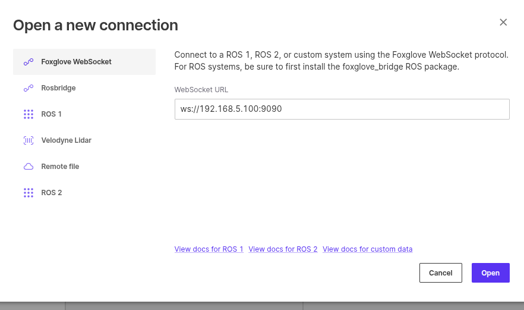

# 這份檔案主要世講關於相機的部份
## 講一下相關套件
```
sudo mkdir -p /etc/apt/keyrings
curl -sSf https://librealsense.intel.com/Debian/librealsense.pgp | sudo tee /etc/apt/keyrings/librealsense.pgp > /dev/null
```
```
echo "deb [signed-by=/etc/apt/keyrings/librealsense.pgp] https://librealsense.intel.com/Debian/apt-repo `lsb_release -cs` main" | \
sudo tee /etc/apt/sources.list.d/librealsense.list
sudo apt-get update
```
```
sudo apt-get install librealsense2-dkms
sudo apt-get install librealsense2-utils
```
資料連結:https://github.com/IntelRealSense/librealsense/blob/master/doc/distribution_linux.md
## 使用說明
先從連線開始
就 插線
用下方指令可查詢是否有連到以及usb
```
rs-enumerate-devices
```

透過這個指令可以看到相機編號還有usb
## docker-compose_mutiple_camera_realsense
根據所查詢到的相機編號以及usb填入

## 開啟相機
```
git checkout develop
sudo ./camera_mutiple_realsense.sh
```
然後會看到下面畫面

就表示成功了
## foxglove操作說明
foxglove不能幹麻只是協助觀看畫面而已
### 下載

[下載連結](https://foxglove.dev/download)
點開

看port
```
lsof -i :9090

```



然後就看到畫面了
## utils.sh
這個 Bash 腳本的目的是 **自動啟動一組 Docker Compose 檔案並監聽它們的 log，並在你按下 Ctrl+C 時自動清理（`docker-compose down`）所有服務**。

---

#### 它的主要功能分成三部分：

##### 1. **`main` 函數：**

* 依照你輸入的多個 `.yml` 檔案（Docker Compose 檔）：

  * 啟動所有服務（`up -d`）
  * 顯示即時 log（`logs -f`）
  * 把這些 `.yml` 檔名稱記錄起來，準備用於後續關閉服務

##### 2. **Docker Compose 指令自動判斷：**

* 支援老的 `docker-compose`（獨立套件）與新的 `docker compose`（Docker CLI 內建）
* 根據環境選對的指令執行

##### 3. **`cleanup` 函數 + `trap`：**

* 一旦你按 Ctrl+C（觸發 `SIGINT`）：

  * 執行 `docker-compose down` 關閉所有服務
  * 不會留殘骸在背景

---

#### 使用方法：

假設你有兩個 Docker Compose 檔案：

* `docker-compose-db.yml`
* `docker-compose-app.yml`

你可以執行這個腳本像這樣：

```bash
./your_script.sh docker-compose-db.yml docker-compose-app.yml
```

它會：

1. 啟動這兩個 Compose 檔案的服務（背景模式）
2. 顯示 log
3. 按 Ctrl+C 就會自動關掉所有服務


