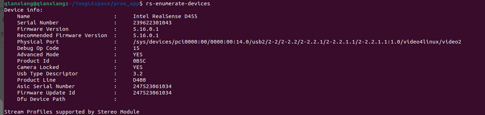
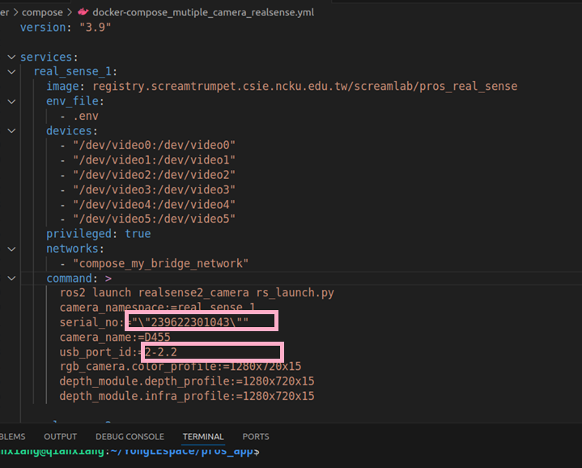
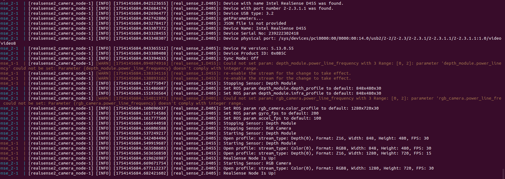

# 這份檔案主要世講關於相機的部份
## 講一下相關套件
```
sudo mkdir -p /etc/apt/keyrings
curl -sSf https://librealsense.intel.com/Debian/librealsense.pgp | sudo tee /etc/apt/keyrings/librealsense.pgp > /dev/null
```
```
echo "deb [signed-by=/etc/apt/keyrings/librealsense.pgp] https://librealsense.intel.com/Debian/apt-repo `lsb_release -cs` main" | \
sudo tee /etc/apt/sources.list.d/librealsense.list
sudo apt-get update
```
```
sudo apt-get install librealsense2-dkms
sudo apt-get install librealsense2-utils
```
資料連結:https://github.com/IntelRealSense/librealsense/blob/master/doc/distribution_linux.md
## 使用說明
先從連線開始
就 插線
用下方指令可查詢是否有連到以及usb
```
rs-enumerate-devices
```

透過這個指令可以看到相機編號還有usb
## docker-compose_mutiple_camera_realsense
根據所查詢到的相機編號以及usb填入

## 開啟相機
```
git checkout develop
sudo ./camera_mutiple_realsense.sh
```
然後會看到下面畫面

就表示成功了
## [foxglove操作說明](./foxglove操作說明.md)

## [utils.sh是幹啥用的](./utils.md)
         
## [獲取相機內外參](./獲取相機內外參.md)
## [跑模型找物體](./camera_api.md)