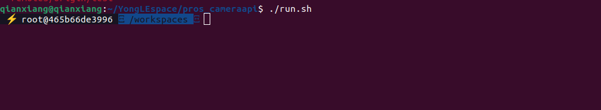
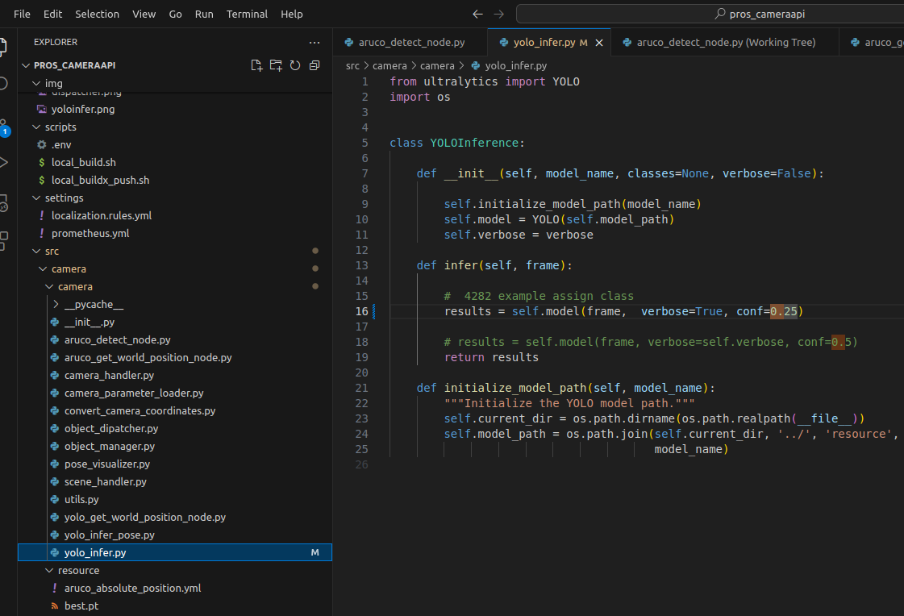
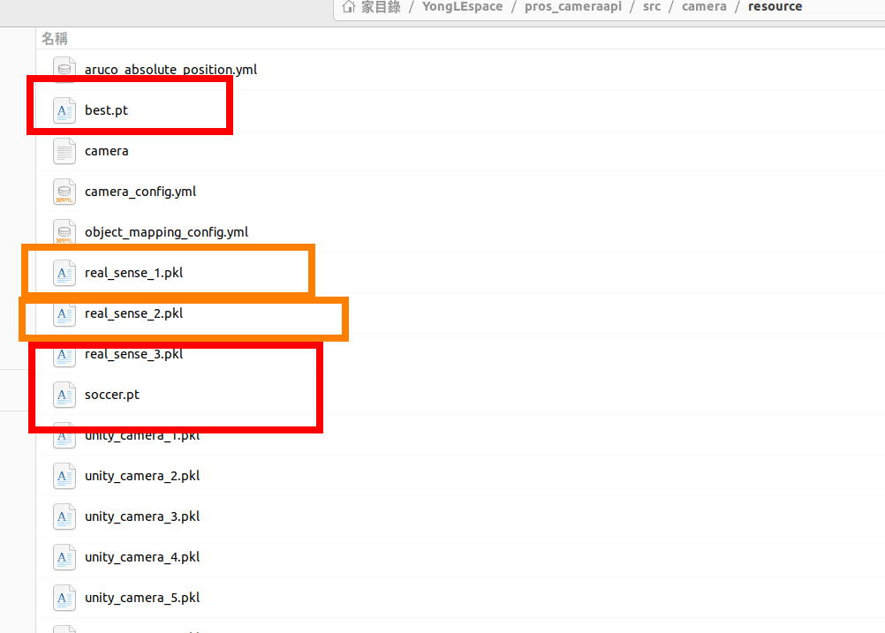
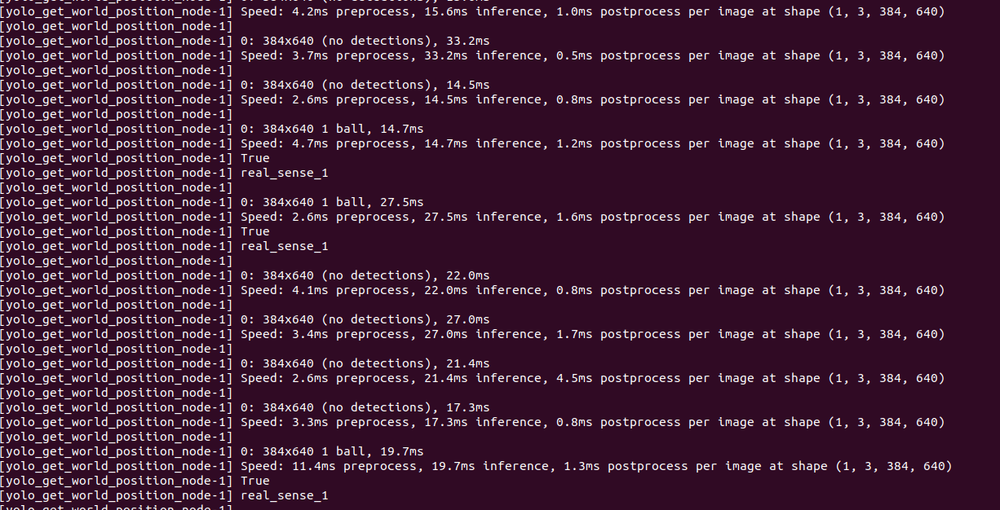
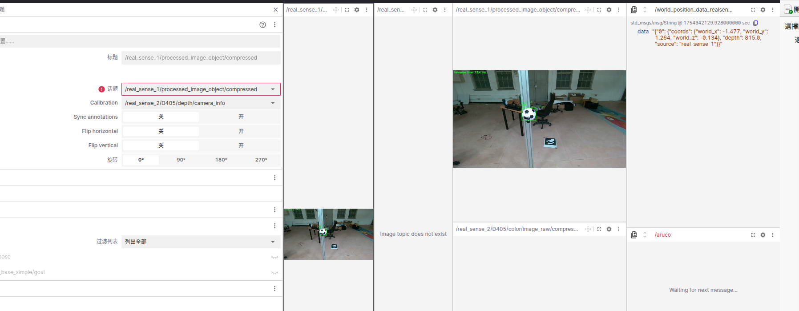

```
git clone https://gitlab.screamtrumpet.csie.ncku.edu.tw/Wang-Yong-Le/pros_cameraapi.git
git checkout ball_camera
```
到pros_api輸入下方指令
```
./run.sh
```
看到下方畫面後輸入r
```
r
```


在yolo_infer這個檔案中可以更改他的準確度

把你的模型還有相機參數丟到src/camera/resouece裡面

跑個指令,記得將soccer.pt換成你的模型
```
ros2 launch pros_camera_api_bringup localization_service.py scene_name:=realsense yolo_name:=soccer.pt

```
你的terminal會長這樣

打開foxglove將話題改成processed_image_object/compressed可以看到被框起來的物體
監聽world_position_data_realsense_1可以看到世界座標
