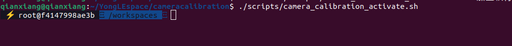
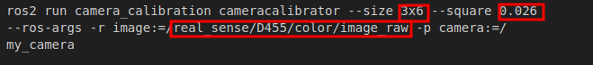
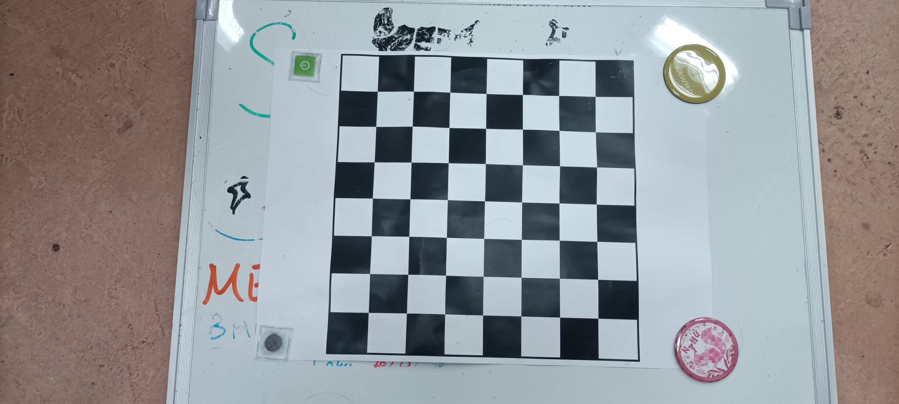
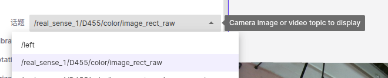
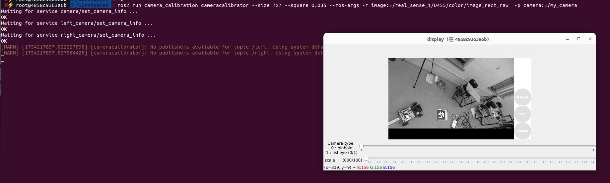
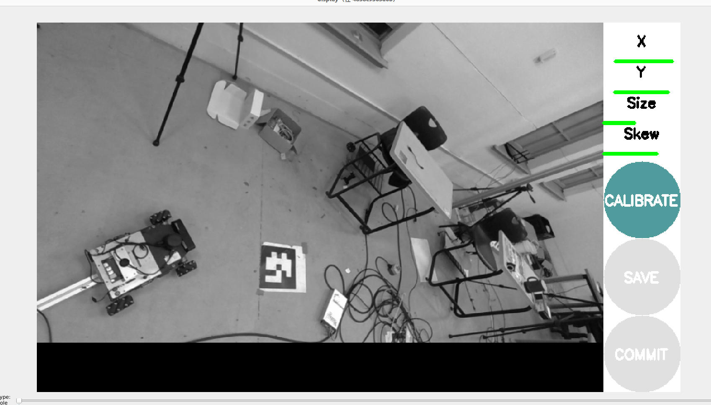
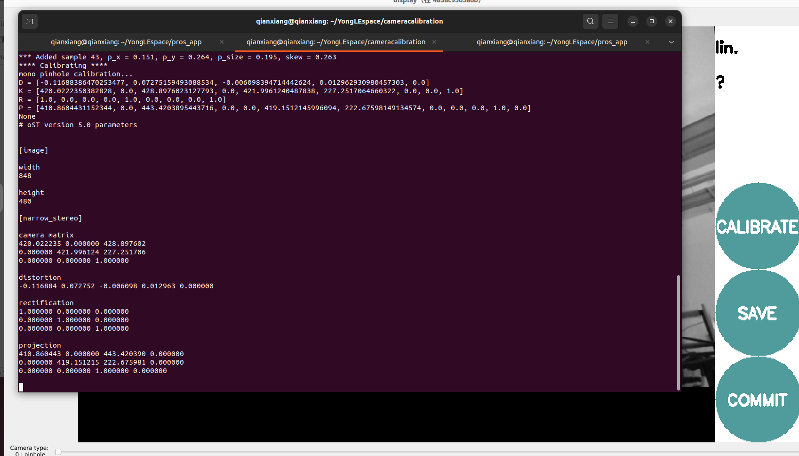
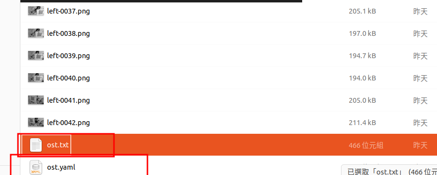
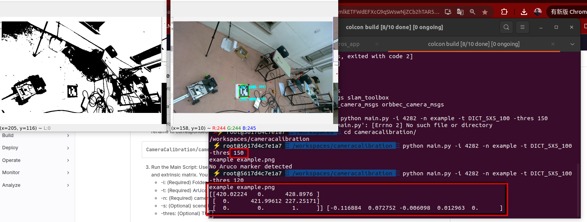

## 打開相機
```
git clone https://github.com/WANG-YongLE/pros_app.git
cd pros_app/
git checkout cr5
sudo ./camera_mutiple_realsense.sh
```

## 計算內參

```
git clone https://gitlab.screamtrumpet.csie.ncku.edu.tw/screamlab/cameracalibration.git

git checkout V0.0.2

xhost +

./scripts/camera_calibration_activate.sh

```
然後你就會到這個畫面

輸入指令

在輸入之前需要改一些東西
size後面要改成你準備的格子size
下圖就是7＊7

後面的0.026單位是公里要改成小格子的大小
image 要改成你的topic
```
ros2 run camera_calibration cameracalibrator --size 3x6 --square 0.026 --ros-args -r image:=/real_sense/D455/color/image_raw -p camera:=/
my_camera

```
[參考連結](https://docs.nav2.org/tutorials/docs/camera_calibration.html)

然後就會看到下面的畫面


然後你就拿著你的格子在鏡頭前面亂轉直到旁邊的進度條全部變成綠色

按下calibrate
你的terminal會跳出一堆數字就是你的內參

按save

crl+c退出然後輸入下方指令
```
mv /tmp/calibrationdata.tar.gz /workspaces/cameracalibration/nav_calibartion_data
```
你就會在你的資料夾中看到它

把它解壓縮你會看到一堆照片還有ost.txt和ost.yaml都是你的相機內參
## 外參
你需要透過你的相機拍一張包含aruco的照片,拍的照片必須包含至少一個地圖中的aruco
[與地圖相關描述連結](./地圖.md)

將你的圖片移動至
```
CameraCalibration/camera_data/4282/images
```
將你的內參（yml檔）移動至
```
CameraCalibration/camera_data/4282/matrix

```
阿記得把名稱改一樣

到workspaces/cameracalibration執行下方指令

```
python main.py -i 4282 -n example -t DICT_5X5_100 -thres 150
```
如果terminal跳說看不到aruco的話可嘗試調整thes後面的數字

然後你就會在output下面看到你的外參